# **Windows 11 Installation on VMware Workstation 25H2**


## **1. Introduction**

This guide walks you through installing Windows 11 on VMware Workstation 25H2 in a lab environment.
It is designed for learning, testing, and homelab setups.

You will need:

* A Windows 11 ISO
* VMware Workstation installed
* Minimum required system resources
* (Optional) VMware Tools for better VM performance

---

## **2. Prerequisites**

* [VMware Workstation 25H2](https://www.vmware.com/products/desktop-hypervisor/workstation-and-fusion)
* Windows 11 ISO (from the official [Microsoft website](https://www.microsoft.com/en-us/software-download/windows11))
* Minimum VM specifications:

  * 4 GB RAM (8 GB recommended)
  * 2 CPU cores
  * 64 GB disk space
  * UEFI enabled
  * TPM 2.0

---

## **3. Create the Virtual Machine**

1. Open VMware Workstation and click **Create a New Virtual Machine**
   

2. Choose **Typical (Recommended)** and click *Next*

   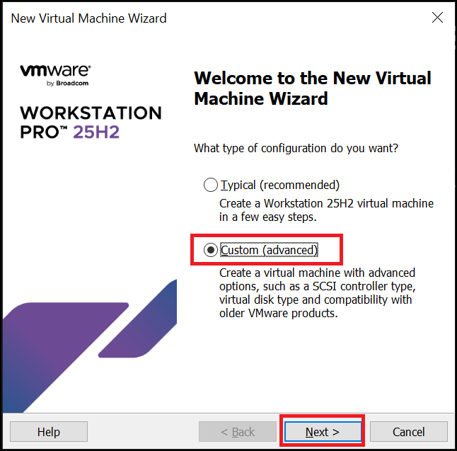

3. Select **Hardware Compatibility** and click *Next*

   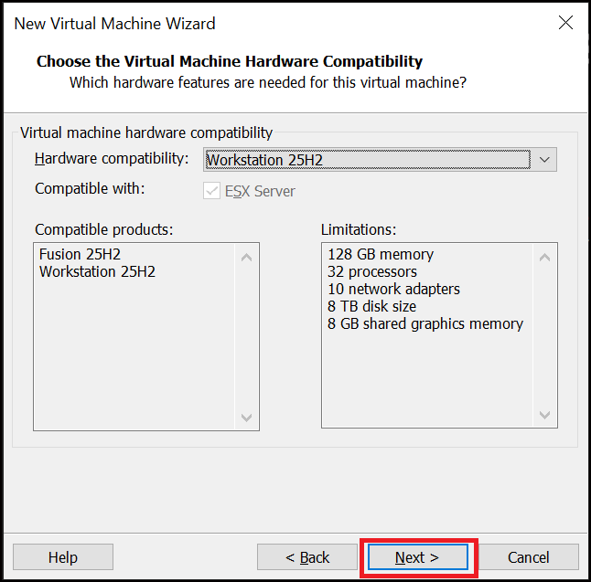

4. Choose **Installer disc image (ISO)** → browse to your Windows 11 ISO → *Next*
   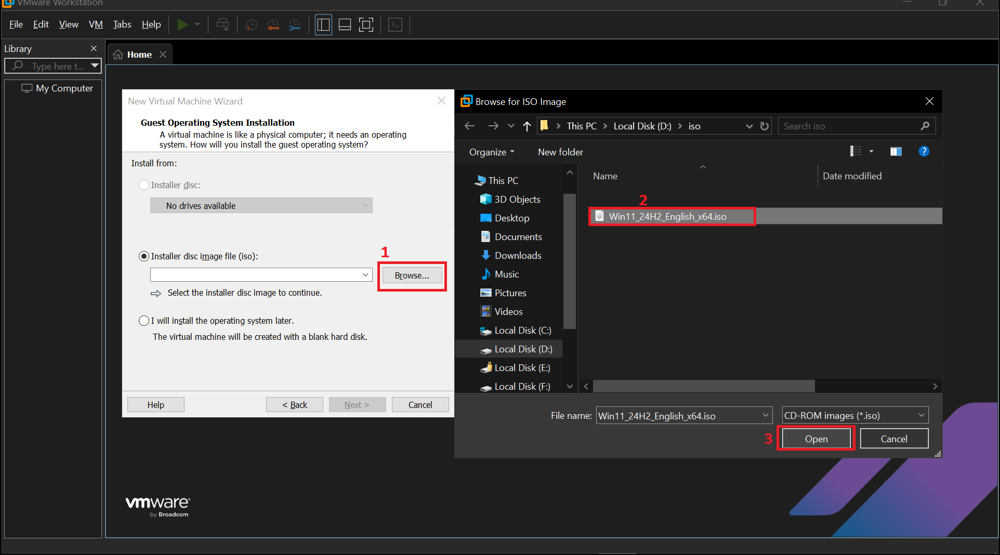

5. Enter a VM name such as `Windows11-Lab`, choose a storage location with enough free space → *Next*
   

6. Configure encryption as required → *Next*

   

7. Set firmware type to **UEFI (Recommended)** → *Next*

   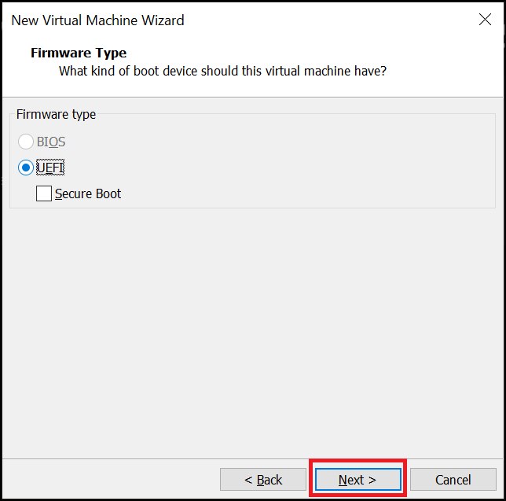

8. Configure processor settings according to your CPU (multiple cores recommended) → *Next*
   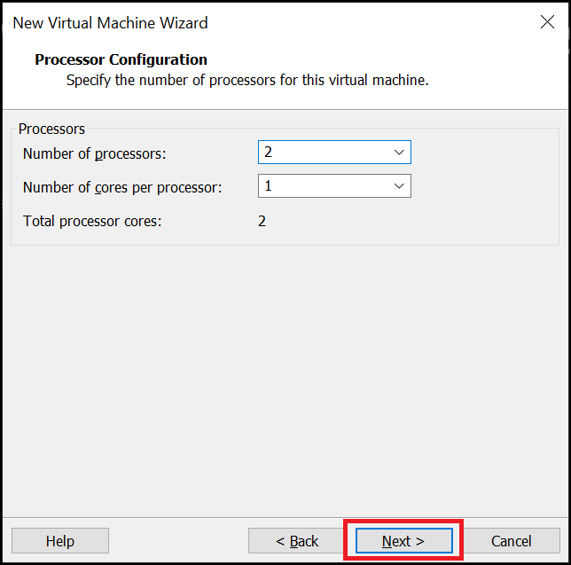

9. Choose memory size.

   * If you have 16 GB system RAM: assign 8 GB
   * If you have 8 GB system RAM: assign 4 GB
     → *Next*

     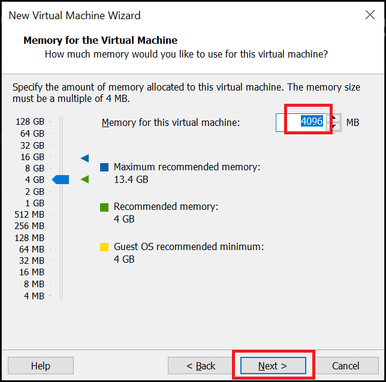

10. Select **NAT** as the network connection → *Next*

    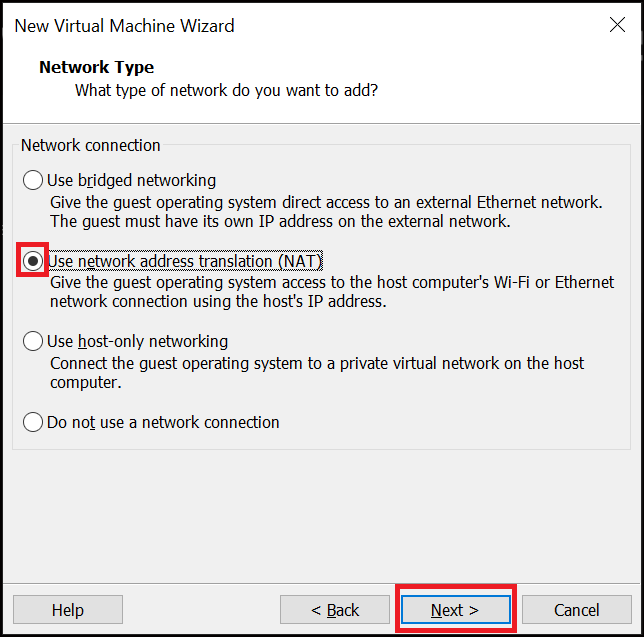

11. Select the recommended I/O controller and disk type → *Next*

<table>
<tr>
<td>

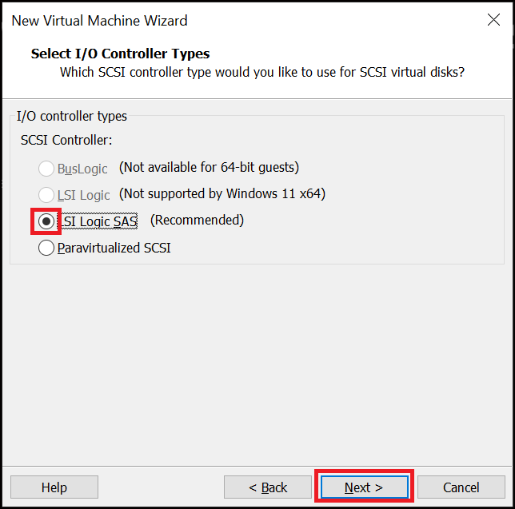

</td>
<td>


</td>
</tr>
</table>

12. Choose **Create a new virtual disk** → *Next*

    

13. Keep recommended disk size (64 GB), select disk file location → *Next*

    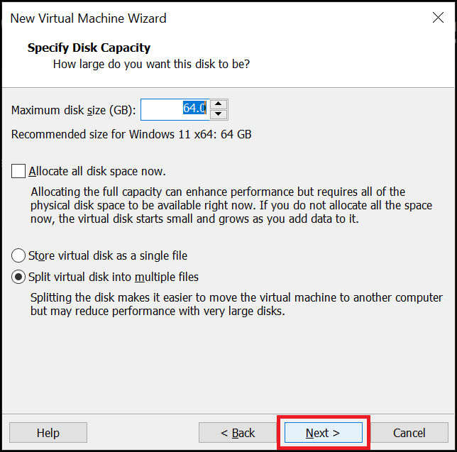

14. Check **Power on this virtual machine after creation** → *Finish*

    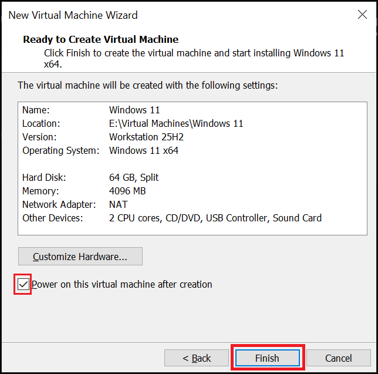

---

## **4. Install Windows 11**

Follow the on-screen setup steps:

1. Select your preferred **language** and **keyboard layout**

2. Click **Install Windows 11**
   On the product key screen, click **I don’t have a product key**

<table>
<tr>
<td>

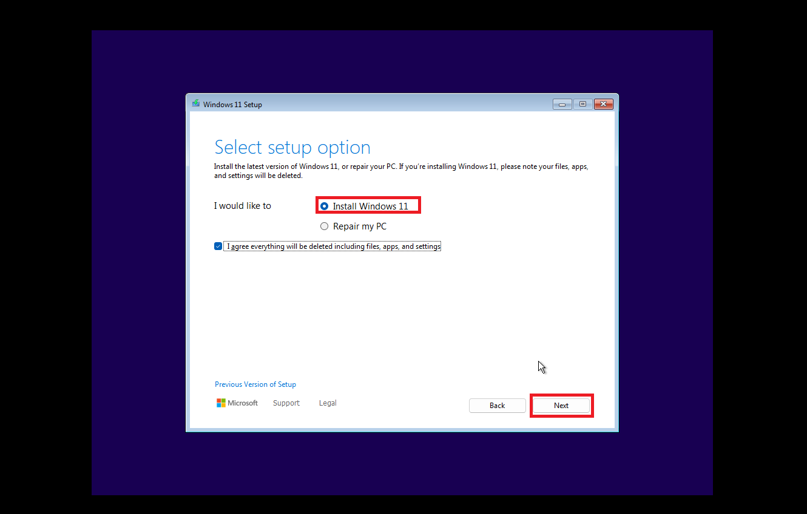

</td>
<td>

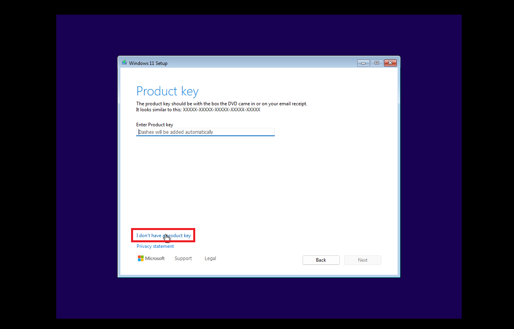

</td>
</tr>
</table>

3. Select **Windows 11 Pro** → *Next*
   Accept the license agreement
   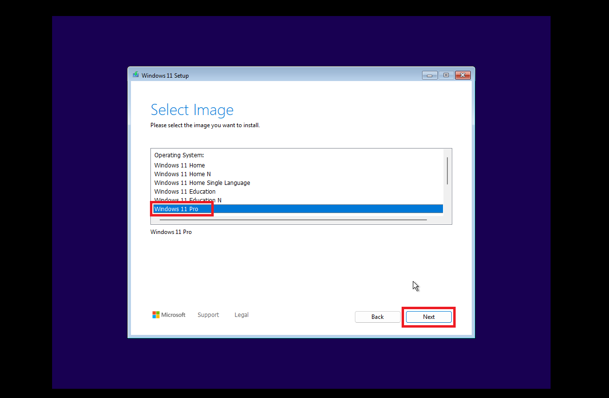

4. On the installation location screen, select the disk and click **Next**, then **Install**

<table>
<tr>
<td>

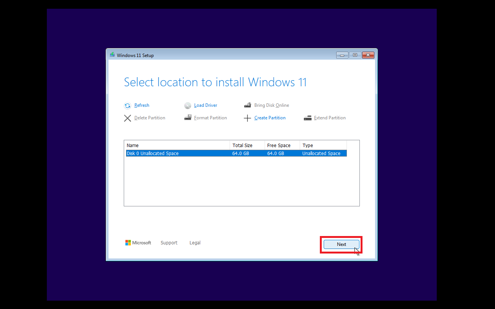

</td>
<td>


</td>
</tr>
</table>

5. Wait for Windows setup to complete
6. Go through the out-of-box experience (OOBE)
7. After logging in, Windows will load — though not in full screen yet
   

---

## **5. Post-Installation (VMware Tools)**

Install VMware Tools for improved graphics, mouse integration, and full-screen resolution.

1. In VMware Workstation, click **VM → Install VMware Tools**
   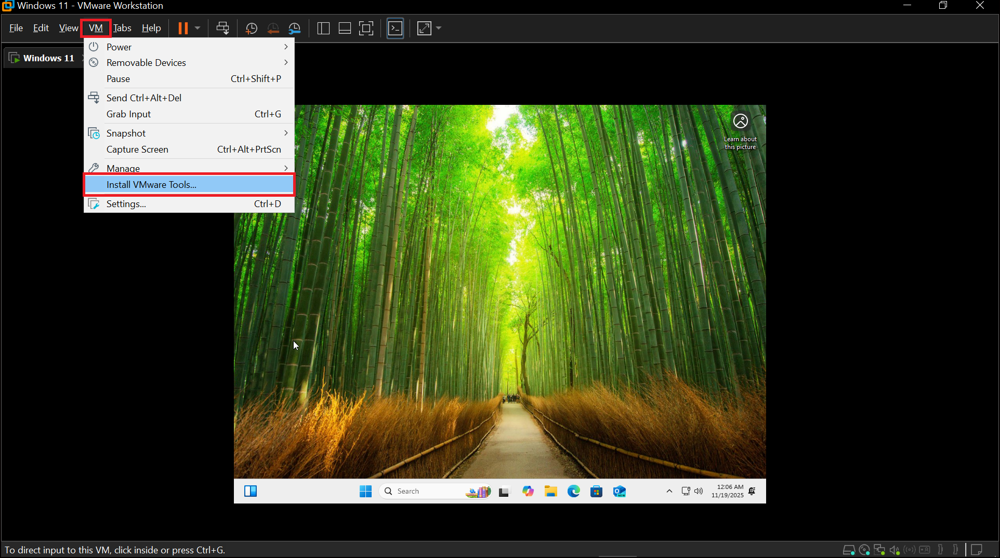

2. A pop-up will appear inside the VM. Open it and start the setup:
   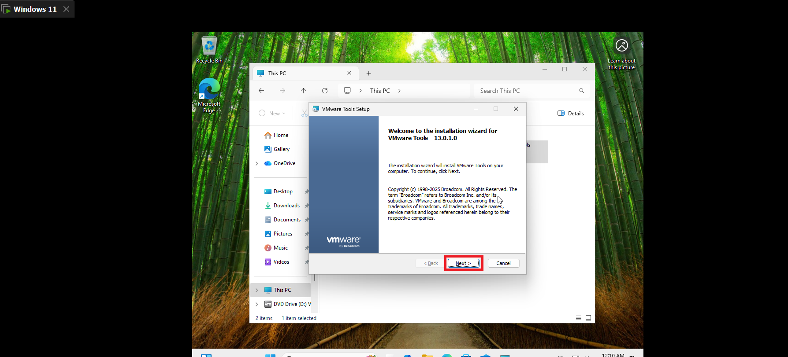
   
   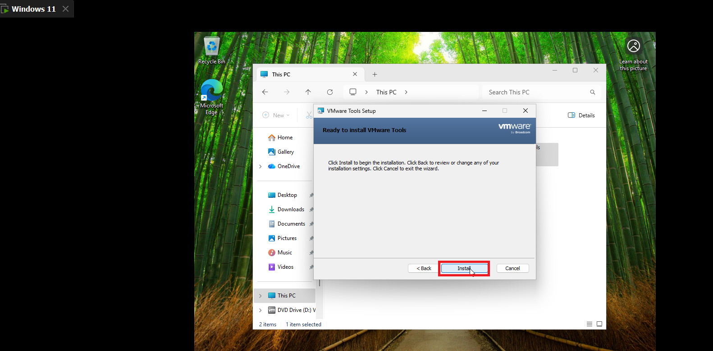

3. After installation, reboot the VM.
   You should now have full-screen display and smooth performance.
   

4. (Optional) Take a clean snapshot.

---

# **Install Sysmon**

1. Inside the Windows 11 VM, download [Sysmon](https://learn.microsoft.com/en-us/sysinternals/downloads/sysmon)

   Extract the downloaded ZIP file and open the folder:
   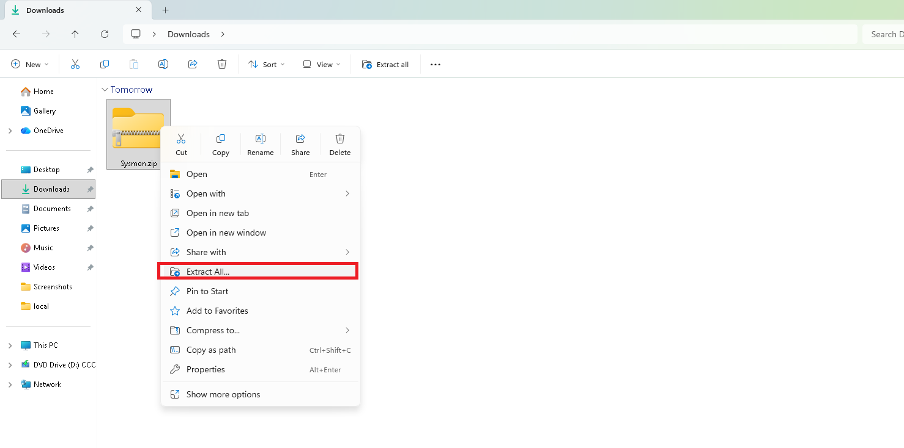

2. Download the Sysmon Modular [config](https://raw.githubusercontent.com/olafhartong/sysmon-modular/refs/heads/master/sysmonconfig.xml) (by Olaf Hartong) 
   

   Save this file **inside the same Sysmon folder**.

3. Open PowerShell **as Administrator** inside that folder.

4. Install Sysmon:

```
.\Sysmon64.exe -accepteula -i .\sysmonconfig.xml
```

5. Confirm that Sysmon is running:

```
Get-Service Sysmon64
```

> Note: If you used a different configuration file name, update the command accordingly.

6. Verify Sysmon events:

```
Get-WinEvent -LogName Microsoft-Windows-Sysmon/Operational | Select-Object -First 10
```


You can also confirm through Event Viewer:

`Applications and Services Logs > Microsoft > Windows > Sysmon > Operational`


At this point, your Windows 11 VM is fully set up with Sysmon running.

---
